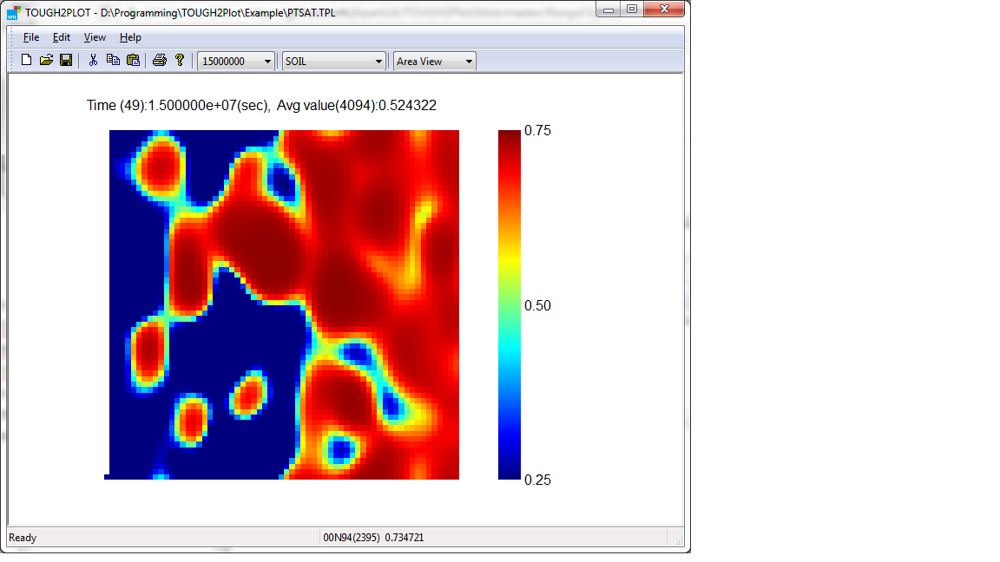
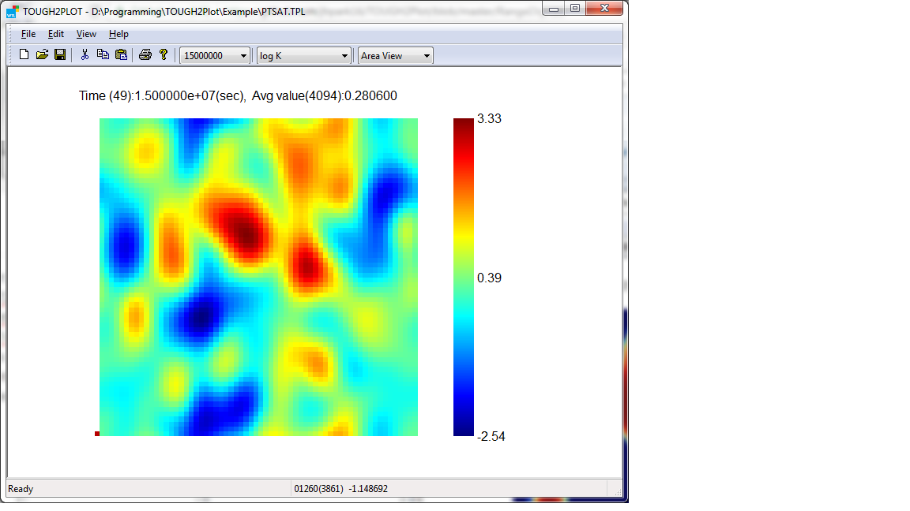

# TOUGH2Plot
A Windows Graphical User Interface to visualize the output of a TOUGH2 multiphase simulations. 
For efficiency reason, TOUGH2 needs to be modified to produce binary output files instead of regular text output. The binary output contains this application uses a customized out TOUGH2PLOT requires HGRID.TPG in the directory of the TOUGH2 binary output.

The saturation of oil at 1.5x10^7 seconds is shown below.

The permeability of the formation is shown below.

